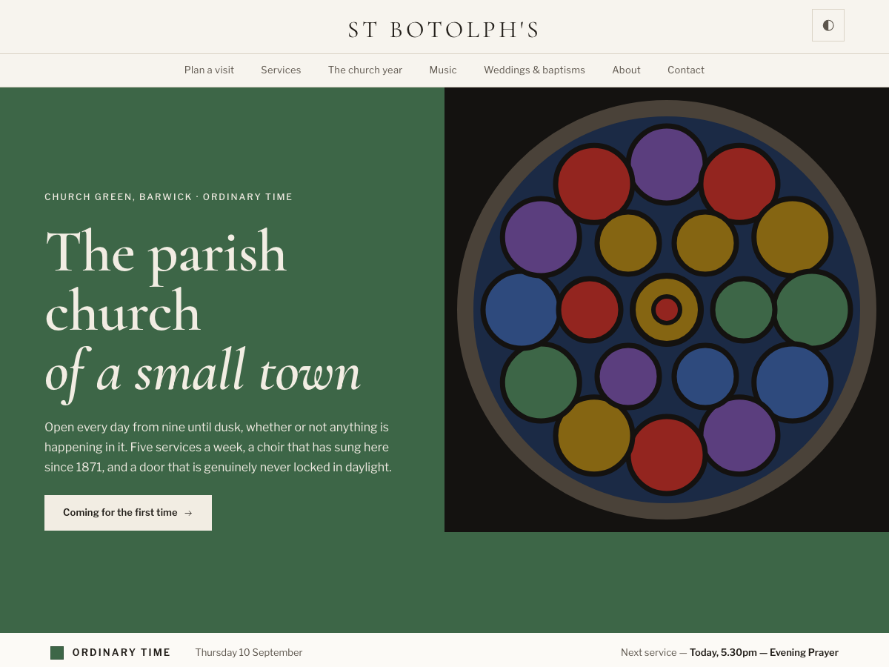

# Canterbury — a free WordPress theme for churches

A free website template for Anglican, Episcopal and Catholic parishes. It knows the church year: the season is computed from the date and colours the page, and the movable feasts are worked out rather than typed in, so the calendar is never out of date. Pages for services, music, the church year, and weddings, baptisms and funerals. Self-hosted typefaces, dark mode, and no external requests.

**[Live demo](https://churchcreation.com/demo/canterbury/)** · **[About this template](https://churchcreation.com/templates/canterbury/)** · GPL-2.0-or-later

## Installing

Download this repository as a ZIP, then in WordPress go to **Appearance → Themes
→ Add New → Upload Theme**, and activate.

## Setting it up

1. **Appearance → Customize → Church details** — name, address, telephone, email
   and giving link. They appear in the header, the footer and the structured data
   together, so they cannot drift apart.
2. **Appearance → Menus** — assign menus to the **Primary** and **Footer**
   locations.

Service times and everything else that varies page to page live in your page
content, edited with the block editor. Only the details that repeat on every page
are Customizer settings.

## About the images

This theme ships **no photography**. The HTML edition of this template bundles
Unsplash images, which the Unsplash Licence permits — but wordpress.org requires
every bundled resource to be GPL-compatible, and it is not. Upload your own
photographs through the media library; a real picture of your building and your
people will outperform a stock photograph anyway.

The ornament panels in assets/ornament/ are our own work, and are there for a
church that has no photographs yet.

## Licence

GPL-2.0-or-later — see [LICENSE](LICENSE). The bundled typefaces are SIL OFL 1.1;
see assets/fonts/FONTS.md.

---

One of ten [free church website templates](https://churchcreation.com/templates/)
from ChurchCreation, also available for
[Eleventy, Jekyll, Astro and Hugo](https://github.com/ChurchCreation).
